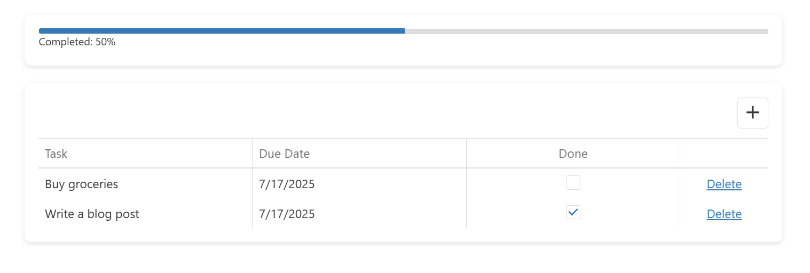

<!-- default badges list -->

<!-- default badges end -->
# Getting Started with DevExtreme

This repository contains code referenced in the following DevExtreme step-by-step tutorial: [First Steps](https://js.devexpress.com/Documentation/Guide/Common/First_Steps/). 

The sample application includes two DevExtreme UI components: [DataGrid](https://js.devexpress.com/Documentation/Guide/UI_Components/DataGrid/Overview/) and [ProgressBar](https://js.devexpress.com/Documentation/Guide/UI_Components/ProgressBar/Overview/). Our DataGrid displays task information (you can mark them as complete or incomplete). The ProgressBar above the DataGrid communicates task progress.

## Files to Review

- **jQuery**
    - [index.js](jQuery/src/index.js)
- **Angular**
    - [app.component.html](Angular/src/app/app.component.html)
    - [app.component.ts](Angular/src/app/app.component.ts)
- **Vue**
    - [Home.vue](Vue/src/components/HomeContent.vue)
- **React**
    - [App.tsx](React/src/App.tsx)
- **NetCore**    
    - [Index.cshtml](ASP.NET%20Core/Views/Home/Index.cshtml)

## Documentation

- [First Steps](https://js.devexpress.com/Documentation/Guide/Common/First_Steps/)
- [DataGrid](https://js.devexpress.com/Documentation/Guide/UI_Components/DataGrid/Overview/)
- [ProgressBar](https://js.devexpress.com/Documentation/Guide/UI_Components/ProgressBar/Overview/)

<!-- feedback -->
## Does this example address your development requirements/objectives?

 

(you will be redirected to DevExpress.com to submit your response)
<!-- feedback end -->
